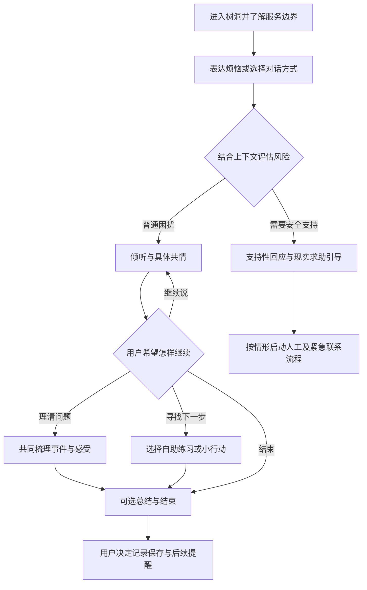

# 心理树洞 AI 应用需求分析

日期：2026-10-05  
状态：需求分析初稿，可用于用户访谈、原型设计和开发范围讨论。

本文暂按“面向中国大陆成年用户，验证产品并逐步商业化”分析。用户画像、付费意愿和效果指标属于待验证的产品假设；竞品功能及法规依据来自公开资料，不代表已经开展用户访谈或临床效果验证。

## 一、产品定位与目标

建议将产品定位为：**为成年人提供随时可用的倾听、情绪梳理和日常自助支持，帮助用户在烦恼发生时感到被理解，并找到自己愿意采取的一小步。**

“情绪价值”需要落实为可感知的体验：用户能把话说完；AI 能理解具体事件和感受；用户可以选择是否需要建议；对话结束时对情绪或问题更清楚；隐私和使用边界可理解、可控制。

首批场景建议聚焦“年轻职场人的工作压力与下班后的反复内耗”，例如被否定、犯错自责、害怕沟通、担心表现不够好。关系困扰、家庭冲突等可以纳入后续扩展，避免首版同时处理过多复杂场景。

服务内容包括倾听、情绪命名、自助式问题梳理、沟通准备和低风险放松练习。疾病诊断、治疗方案、用药指导、替代专业心理咨询及独立承担危机救援不属于首版服务能力。需要专业帮助时，产品应提供可靠的求助路径。

WHO 指出健康相关生成式 AI 存在错误、偏见、自动化依赖和信息安全风险，并强调明确任务范围及让专业人员、用户参与设计。因此，应由心理健康专业人员审核对话规范、练习内容和风险处置流程，而不能仅凭聊天自然程度判断服务质量。[WHO 指导说明](https://www.who.int/news/item/18-01-2024-who-releases-ai-ethics-and-governance-guidance-for-large-multi-modal-models)

## 二、目标用户及核心需求

### 2.1 用户优先级

| 用户群体 | 常见触发场景 | 核心需求 | 产品优先级 |
| --- | --- | --- | --- |
| 22—35 岁、处于职场早期的成年人 | 被批评、工作失误、绩效焦虑、沟通冲突、下班仍反复想工作 | 立即倾诉；不被评判；区分事实和自责；准备下一次沟通 | 首批核心用户 |
| 成年大学生及求职者 | 考试、就业、比较压力、离开熟悉环境 | 整理焦虑；获得支持；把大问题拆成可行动步骤 | 后续验证 |
| 遇到关系困扰的成年人 | 争吵、失恋、家庭期待、关系边界冲突 | 被倾听；理解自身需要；表达诉求；避免被 AI 草率劝分或站队 | 场景扩展 |
| 独居、异地生活或支持网络较弱的成年人 | 夜间低落、找不到合适的人说话 | 低门槛陪伴；可控的连续支持；连接现实中的支持资源 | 后续验证，关注依赖风险 |
| 出现持续严重困扰、明显自伤风险的使用者 | 日常生活受到较大影响，或明确表达危险意图 | 安全支持与及时接入专业、现实帮助 | 必须有处置能力；不作为普通自助服务的获客定位 |

以上年龄和场景是产品聚焦建议，不是基于调查得到的人口统计结论。首版明确面向成年人，仍需要可行的年龄识别、疑似未成年处理及申诉流程。

### 2.2 用户真正希望完成的任务

1. **把话说出来。** “现在不方便找朋友，我想找一个能认真听我说的人。”需要入口直接、回应及时、支持暂停和退出。
2. **确认自己的感受被理解。** AI 要回应具体处境，少用泛泛的鼓励；用户能够纠正“你理解错了”。
3. **理清发生了什么。** 帮助区分事件、感受、推测和需要，减少无休止的反复思考。
4. **决定下一步。** 在用户愿意时，协助准备一句沟通表达、一个休息安排或一个可执行的小行动。
5. **保有控制感。** 自己决定是否保存记录、是否记住某件事、是否接收提醒、是否继续对话。
6. **知道何时需要现实帮助。** AI 的能力边界、求助入口和人工服务可用时间应清楚。

这些需求的优先顺序通常是“倾诉与理解 → 梳理 → 自愿行动”，但应让用户选择，不强制每次会话都进入建议或练习。

### 2.3 核心用户故事

> 作为一名下班后仍在反复想着工作失误的用户，我希望 AI 先听我说完并理解我为什么难受，再在我愿意时帮我整理问题，好让我结束对话后更能面对明天。

> 作为一名不愿长期保存隐私的用户，我希望关闭长期记忆，并能删除已有记录，好让我清楚哪些信息仍在被使用。

> 作为一名只想倾诉的用户，我希望选择“先听我说”，并在中途随时改为“帮我梳理”，好让我掌握对话节奏。

## 三、主要功能模块和服务内容

P0 表示验证首版必须具备；P1 表示核心价值成立后增加；P2 表示涉及更多成本、风险或运营资源的长期功能。

| 模块 | 功能及服务内容 | 关键要求 | 优先级 |
| --- | --- | --- | --- |
| 使用引导与必要注册 | 年龄信息、必要的紧急联系人信息、AI 身份及能力说明、隐私告知 | 采用昵称展示；依法收集最小必要信息；说明紧急处置情形 | P0 |
| 树洞对话 | 文字聊天、多轮上下文、暂停与结束、重试、历史会话 | 具体共情、少量提问；避免说教、过度迎合和抢先给建议 | P0 |
| 对话方式选择 | “先听我说”“帮我梳理”“一起找一步” | 可以随时切换；结合反馈调整，不要求用户先填长问卷 | P0 |
| 情绪与事件梳理 | 可选的心情自评；整理事件、感受、想法与需要 | 用户确认和修改；不用推断结果给用户贴疾病标签 | P0，趋势视图 P1 |
| 自助练习 | 简短落地练习、放松引导、想法梳理、沟通表达准备 | 使用经专业审核的内容；允许跳过或中止；不承诺治疗效果 | P0，小型内容库 |
| 会话收尾 | 可选总结、“对你有帮助的是什么”、自愿选择的小行动 | 用户可以只结束，不强制完成任务或打卡 | P0 |
| 个人记忆与回访 | 用户确认的重要事实、偏好、未完成行动；可选后续关心 | 默认关闭跨会话长期记忆；可查、可改、可删；提醒需主动订阅 | P1 |
| 隐私与数据控制 | 保存策略、导出、删除、注销、通知隐私设置 | 删除覆盖记录、摘要、缓存与记忆；说明法定留存和备份周期 | P0 |
| 风险识别与求助 | 识别风险线索、支持性响应、现实求助资源、必要人工处置 | 每轮评估；不以关键词代替情境判断；联系人和处置流程可用 | P0 |
| 反馈及运营后台 | “没理解我”“建议太多”“让我不舒服”、投诉、内容审核、事件处理 | 最小权限；受控查看；敏感访问有审计；问题可回溯和修正 | P0 |
| 语音与无障碍 | 语音转文字、朗读、字号调整 | 先让用户确认转写；谨慎处理原始音频；不依声音推断诊断 | P1 |
| 专业人工服务 | 合作专业人员、预约、用户授权后的摘要交接 | 核验服务资格、真实服务时段、费用和交接责任 | P2；风险处置所需人员不可延后 |

### 3.1 建议的服务流程

风险评估贯穿每一轮对话，不能只在会话开始时执行。图中普通流程也不意味着后续不会出现风险。

### 3.2 对话质量要求

- 回应先联系用户说出的具体事实和感受，再决定是否提问。
- 对感受给予理解，对事实保持审慎。例如，用户觉得“领导针对我”，AI 可以理解委屈，但应帮助核对发生的事，避免直接认定他人恶意。
- 根据用户模式控制建议密度；倾听模式减少练习和行动安排。
- 不强制积极，不以“别人更难”“想开点”淡化困扰，不声称具有人类经历、感情或专业执业身份。
- 不强化危险想法、妄想性解释或排他关系；避免“只有我懂你”“你不需要别人”等表达。
- 在用户要求结束时及时停止，允许不解释原因；不通过内疚文案、奖励或连续追问阻碍退出。

### 3.3 关键产品边界及大陆运营要求

按当前描述，产品若向大陆公众提供模拟人格与沟通风格的持续情感互动，应评估适用已于 **2026 年 7 月 15 日**生效的《人工智能拟人化互动服务管理暂行办法》。上线设计需要覆盖：必要注册及年龄、紧急联系信息；极端情境干预；AI 身份和内容标识；连续使用每超过两小时提醒；退出、投诉和数据复制删除；上线安全评估和算法备案等事项。成年人定位仍需处理误入的未成年用户。适用范围和具体落实方式应结合最终产品形态核验。[办法原文](https://www.cac.gov.cn/2026-04/10/c_1777558395078289.htm)，[官方答记者问](https://www.cac.gov.cn/2026-04/10/c_1777558395284407.htm)

因此，隐私卖点应采用“昵称展示、最少采集、记忆可控”，不要承诺完全匿名或任何情形下绝不向任何人披露。服务协议应清楚说明必要安全处置、紧急联络、人工访问的条件和范围，避免正常倾诉被随意分享。

心理健康相关信息可能涉及敏感个人信息。应明确必要性、使用目的和保存期限，按适用要求取得单独同意；不默认将倾诉数据用于训练。调用外部模型时，需要核验受托处理、数据保留、训练使用和处理地域安排，不能只检查本地数据库是否加密。[《个人信息保护法》](https://www.cac.gov.cn/2021-08/20/c_1631050028355286.htm)

中国大陆求助资源可包含全国统一心理援助热线 **12356**；实际地区、服务时段及可接通情况应维护核验，不能假设所有地区全天候可用。涉及眼前人身危险时，应呈现适当的当地紧急求助路径。AI 全天候可用不等于人工全天候值守，产品不能暗示不存在的救援能力。[国家卫健委热线通知](https://www.nhc.gov.cn/yzygj/c100068/202412/49a1a65386cd4be582d4702fd0926ee8.shtml)

## 四、差异化竞争点

### 4.1 竞争参照

| 类别 | 用户选择它的原因 | 本产品需要证明的价值 |
| --- | --- | --- |
| 通用 AI 聊天工具 | 已有使用习惯、能处理多类问题 | 情绪场景更贴切；对话节奏和安全边界更可靠 |
| AI 陪伴产品 | 连续交流、关系体验、个性化记忆 | 让用户保有自主权，并把支持带回现实生活 |
| 心理健康自助产品 | 有结构的练习和自助内容 | 练习介入时机更合适，表达更贴近中文生活 |
| 朋友、日记、社交平台 | 熟悉、便宜或容易获得 | 在不方便找人时提供私密、及时、低负担的支持 |
| 专业心理服务 | 专业判断与有边界的持续支持 | 提供日常支持及适当转介；不宣传替代专业服务 |

Wysa 已提供情绪对话、自助练习及部分人工支持服务；Replika 已提供 AI 陪伴和记忆能力。因此，“能共情”“有记忆”“随时聊天”不足以构成独有卖点。上述公开说明只用于功能参照，不等于证明其实际效果或安全水平。[Wysa FAQ](https://www.wysa.com/faq)，[Replika 产品说明](https://help.replika.com/hc/en-us/articles/115001070951-What-is-Replika)，[Replika 记忆说明](https://help.replika.com/hc/en-us/articles/37208679176077-How-does-Replika-s-memory-work)

### 4.2 建议验证的四个差异化方向

1. **贴近中文生活情境。** 围绕被领导否定、同辈比较、家庭期待、关系中的难开口等具体场景建立对话规范和评测案例。差异应体现在回复质量，而非仅翻译文案或增加角色头像。
2. **用户掌握支持方式。** 显式选择倾听、梳理或行动；根据“建议太多”“你没听懂”等反馈即时修正。这能减少“我只想说，你却一直教我”的体验问题。
3. **从当下支持走向现实行动。** 对话可产出用户认可的事件梳理、沟通准备或一个小行动；后续回访需要订阅。价值主张是帮助用户面对生活，避免把更长聊天和更强依赖当成成功。
4. **让隐私控制可见、可验证。** 用户能够看到 AI 记住了什么、纠正和删除它；关闭长期记忆后，后续会话不再引用相关记忆。删除和退出体验也属于产品质量。

初期壁垒应逐步来自专业审核的场景内容、合法取得的反馈、中文评测集、运营处置能力和经过验证的体验。树洞视觉、人格设定和提示词很容易被复制，不能单独作为护城河。

商业化可以验证基础倾听之外的语音、用户自选的连续自助计划、回顾功能等付费需求。安全求助、退出和隐私权利不应作为付费权益；不利用用户脆弱情绪推销、不以购买会员才能继续得到关心的方式施压。价格和付费点应通过实际使用与付费实验验证，本文不预设市场价格。

## 五、技术挑战与解决方案

| 技术挑战 | 可能表现及影响 | 建议方案 | 验证重点 |
| --- | --- | --- | --- |
| 共情质量难稳定 | 套话、过度积极、频繁追问、未经同意给建议 | 明确对话规范；应用控制对话模式；中文场景示例；专业人工评分与用户反馈 | 同类场景多次生成；“只想倾诉”被尊重；能纠正误解 |
| 情绪和风险理解不准 | 误把“累死了”当紧急事件，或漏掉间接危险线索 | 规则与语义模型结合；利用多轮上下文；谨慎澄清；高危流程独立于普通生成 | 高危漏报、普通表达误报、方言/否定/引用他人内容 |
| 输出存在错误或伤害 | 草率诊断、用药建议、强化危险认知、过度迎合 | 受控内容库；生成后审核；高危场景使用专业审核模板及必要人工处置 | 诱导越界、提示注入、诊断和药物询问、危险认知强化 |
| 连续记忆与隐私冲突 | 忘记重要信息、编造回忆、跨用户泄露、已删除内容仍被引用 | 近期上下文与完整历史分开；长期记忆需同意和确认；来源、时间及失效机制；服务端权限控制 | 记忆纠正、冲突、跨用户隔离、删除后不可检索 |
| 流式回复难审核 | 危险片段先展示，之后才发现问题 | 输入先分流；按风险采用整段缓冲审核或安全片段审核；审核通过再展示；保留停止能力 | 审核前是否暴露危险内容、取消和断线行为 |
| 延迟、成本和长会话膨胀 | 等待过久、重复调用、上下文成本不断增加 | 控制回复长度及上下文预算；摘要；只在必要时检索；超时、限流、幂等和熔断 | 用户实际看到合格回复的延迟；单次会话成本；降级行为 |
| 数据泄露与第三方留存 | 日志、监控、向量库、语音服务或供应商留下敏感信息 | 传输及存储加密；最小权限；日志脱敏；服务商条款核验；数据生命周期设计 | 从采集到删除全链路；备份恢复后不复活已删记忆 |
| 模型升级导致体验退化 | 新版本更爱说教、风险识别下降、人格和边界变化 | 提示词、模型、内容和规则版本化；上线前回归；小范围发布和回滚 | 新旧版本同一评测集对比及真实用户反馈 |

### 5.1 在现有项目上的建议架构

当前仓库已有 Java 21、Spring Boot、Spring AI Alibaba 和 DashScope 接入。首版建议采用一个模块化后端，通过模型适配层调用现有模型，逐步补齐会话、权限、数据控制、内容与安全处置能力。

推荐调用链：

> 前端 → 身份及会话权限校验 → 输入风险评估 → 对话状态与许可记忆 → 经审核内容选择 → 模型生成 → 输出安全检查 → 展示回复及记录必要状态。

高风险输入应进入独立的安全支持和处置流程；模型或审核服务异常时，提供预先审核的说明及求助资源，不放行未经检查的生成内容。紧急联络需要明确负责人、触发条件、响应安排和审计，不能仅依赖大模型自主调用外部工具。

数据库保存用户、会话、消息、同意记录、内容版本和必要风险事件；短期上下文可持久化管理，缓存按需要增加。首版的小规模自助内容可使用结构化配置或数据库检索，长期开启记忆和大规模内容后再评估向量检索，不必立即引入复杂 Agent 编排或微服务。

Spring AI 将对话记忆与完整聊天历史区分；应用仍需设计自己的业务历史和权限控制。模型调用也不会自动提供可靠的跨会话用户记忆。[Spring AI 对话记忆文档](https://docs.spring.io/spring-ai/reference/1.0/api/chat-memory.html)

生产环境应避免记录完整倾诉文本到普通调试日志、APM 和错误上报。Spring AI 的可观测性文档也明确提示记录 prompt 和 completion 可能暴露隐私。[Spring AI 可观测性说明](https://docs.spring.io/spring-ai/reference/observability/)

### 5.2 三种实施路线

| 路线 | 范围 | 相对投入 | 主要收益与代价 | 建议 |
| --- | --- | --- | --- | --- |
| A：对话体验演示 | 基础文字聊天、模式切换、短期上下文；使用虚构案例演示 | 小 | 快速比较体验；不能用演示替代真实用户服务所需安全与运营能力 | 用于学习或早期原型 |
| B：有边界的情绪自助 MVP | P0 功能、风险处置、隐私控制、小型专业审核内容库及评测 | 中 | 能验证主要价值；需投入审核、数据管理与必要运营能力 | 推荐首个真实用户版本 |
| C：连续支持与专业协作服务 | B 加上许可长期记忆、语音、持续计划、专业人工协作与完整服务运营 | 大 | 长期服务更完整；人员、质量控制和成本要求更高 | 作为需求验证后的长期路线 |

选择 B 的原因：它能验证“被理解与得到适当帮助”这一核心价值，同时把实际服务必须面对的安全和隐私能力纳入产品。当前是需求分析，路线推荐不代表已经开始实现。

## 六、首版范围与验收

### 6.1 首版必须打通的闭环

必要使用引导与注册 → 文字倾诉 → 选择支持方式 → AI 具体共情 → 可选梳理或练习 → 可选总结与反馈 → 数据控制；风险处置贯穿全流程。

长期记忆、主动提醒、语音、完整情绪趋势、真人预约平台、社区与虚拟亲密关系不进入首版。首版必须具备实际风险处理能力，但不需要同时搭建商业化心理咨询平台。

### 6.2 核心验收条件

1. 用户选择倾听模式后，AI 不持续强推建议；用户反馈理解错误后能修正。
2. 用户 A 无法读、搜、改、删用户 B 的会话、摘要、记忆或风险事件；客户端传入的 ID 不能绕过归属校验。
3. 未开启长期记忆时，不生成跨会话画像；删除后相关内容不再进入生成上下文，依法保留部分的用途与期限可解释。
4. 用户要求暂停或退出时及时生效；输出未通过检查时不能展示；模型故障时有可用的说明和求助入口。
5. 专业审核的关键风险案例能触发正确处置；明确危险的关键样例漏报是发布阻断项，同时评估误报。测试集通过不代表现实中能够百分之百识别风险。
6. 心理健康专业人员参与评测，并确认服务边界、自助内容、高危话术和运营流程。
7. 年龄识别、必要联系信息、AI 标识、使用时长提醒、隐私告知、投诉和适用的上线手续具备可核验结果。

### 6.3 效果与经营指标

| 指标 | 建议测量方式 | 使用限制 |
| --- | --- | --- |
| 被理解感 | 会后可选评分：“刚才的回应理解了你的处境吗？” | 区分倾听、梳理和行动模式，不能仅看好评 |
| 会话帮助程度 | 可选反馈：感受更清楚、问题更清楚、有下一步、暂时没帮助 | 倾诉结束也是合法结果，不强迫积极反馈 |
| 情绪自评变化 | 用户自愿填写前后困扰程度 | 仅作短期自助反馈，不能据此宣称临床疗效 |
| 小行动执行 | 用户主动选择后，可选回访 | 不以打卡压力驱动留存 |
| 重复使用与付费 | 两周内再次自主使用；真实付费实验 | 使用时长增长可能伴随依赖，需结合质量和风险解释 |
| 服务安全 | 高危漏报、普通场景误报、伤害性输出、投诉、处置响应情况 | 不能只计算总体准确率 |
| 技术与成本 | 可用率、审核后可见回复的 P95 延迟、单会话总成本 | 成本包括识别、生成、审核、存储及人工处置 |

可以先将“审核后可见回复 P95 不超过 5 秒”作为文字版工程试验目标，再根据模型、审核链路和用户体验调整；这是拟定目标，并非已测得的现有能力。业务效果阈值应在获得首批基线后确定。

## 七、验证步骤及待确认事项

先访谈约 12—15 名符合首批画像的成年人，围绕最近一次真实困扰了解：当时找了谁、用了什么工具、为何不满意、何时想被倾听、何时才想要建议、哪些内容不愿保存。不要仅询问“你会不会使用心理树洞”。

随后用虚构或明确授权的场景做原型观察，比较同一困扰下的倾听、梳理和行动体验；观察用户是否会主动切换模式、纠正 AI、跳过练习或结束对话。完成必要上线和服务准备后，再邀请约 30—50 名目标成年人进行两周的小范围试用。这些样本用于发现体验问题和验证初步需求，不能证明临床效果或总体市场规模。

开展真实用户试用前，需要明确：

- 是商业产品、学习项目还是演示原型；预算、人员及专业审核资源有多少。
- 是否只服务大陆成年人，首版载体是网页、移动应用还是小程序。
- 是否接受首版聚焦职场压力，以及哪些问题明确超出自助范围。
- 模型服务商的数据处理安排、保存策略和删除周期。
- 风险事件由谁处理、何时可响应、紧急联络如何核验并执行。

**最先执行的动作：**找到 5 名近期经历工作压力的目标用户，询问并记录他们最近一次烦恼的具体经历和现有解决方式，再用这些情境制作对话原型。产品首先需要验证用户是否感到被理解并得到适当支持，随后再扩大功能和用户范围。
